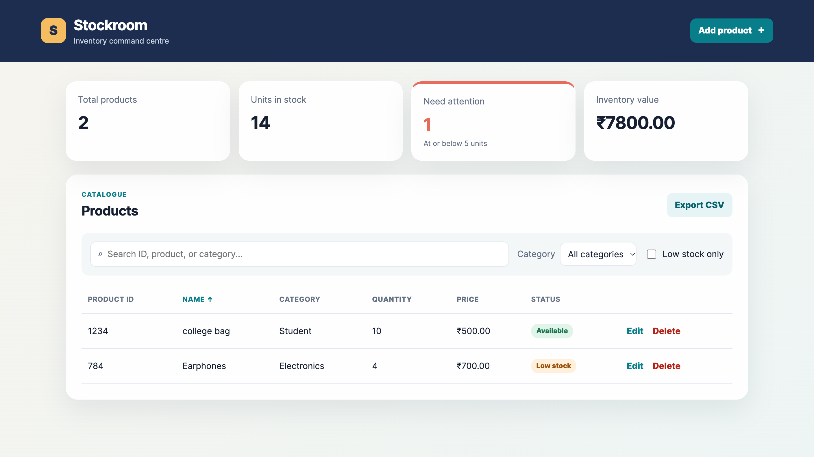
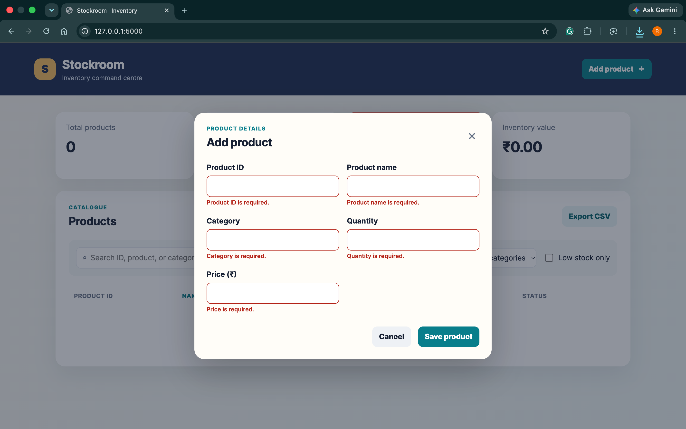
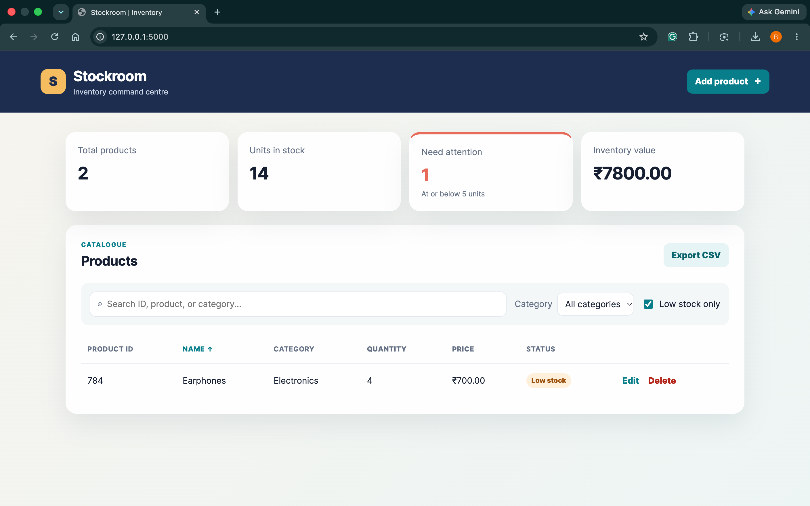

# Stockroom Inventory Management System

A full-stack inventory application built with Flask, SQLite, and browser JavaScript.
It provides persistent product CRUD, live searching, filtering, sorting, low-stock
monitoring, and CSV export without page reloads.

## Table of Contents

- [Technologies Used](#technologies-used)
- [Features](#features)
- [Screenshots](#screenshots)
- [Project Structure](#project-structure)
- [Architecture](#architecture)
- [Prerequisites](#prerequisites)
- [Run](#run)
- [Seed Sample Data](#seed-sample-data)
- [API Reference](#api-reference)
- [Database Schema](#database-schema)
- [Verify](#verify)
- [Limitations](#limitations)
- [Roadmap](#roadmap)
- [Project Report](#project-report)
- [Author](#author)
- [License](#license)

## Technologies Used

- Python 3
- Flask
- SQLite
- HTML, CSS, and JavaScript
- Fetch API
- Node.js and npm (frontend syntax-check script)

## Features

- Add, list, search, update, and delete products through a JSON REST API.
- Product IDs are unique without regard to letter case (`sku-1` and `SKU-1` conflict).
- Strict server validation: JSON integer quantities, finite non-negative prices, and
  explicit limits for IDs (50), names (120), and categories (80) characters.
- Central low-stock setting, used by API statistics and every UI alert/status.
- Dashboard summary cards: total products, units in stock, low-stock count, and total
  inventory value (in ₹).
- Dynamic category and low-stock-only filters; sortable name, quantity, and price columns.
- CSV export of the products currently shown in the table.
- Toast notifications and inline form errors.
- Safe DOM event handling with `data-*` attributes—no inline `onclick` handlers, so
  product IDs and names containing apostrophes work correctly.

## Screenshots

### Dashboard and product catalogue



### Inline form validation



### Low-stock filter



## Project Structure

```
inventory-management-system/
├── app.py                 # Flask app: routes, validation, SQLite access
├── seed.py                # Inserts sample products into the database
├── requirements.txt       # Python dependencies (Flask)
├── package.json           # npm scripts for the frontend syntax check
├── PROJECT_REPORT.md      # Full project report (aim, design, testing, future scope)
├── .gitignore
├── templates/
│   └── index.html         # Single-page UI (dashboard, table, add/edit dialog)
├── static/
│   ├── app.js             # Frontend logic: Fetch API, search, filters, sorting, CSV export
│   ├── style.css          # Styling
│   └── screenshots/       # Images used in this README
├── tests/
│   └── test_api.py        # unittest suite for the REST API and validation
└── instance/
    └── inventory.db       # SQLite database (auto-created, git-ignored)
```

## Architecture

```
Browser (HTML / CSS / JavaScript)
        |
        |  HTTP + JSON (Fetch API)
        v
Flask REST API  (app.py)
        |
        |  SQL
        v
SQLite database  (instance/inventory.db)
```

The page is served by Flask at `/`. All data operations go through the `/api/...`
endpoints, so the UI updates without reloading the page.

## Prerequisites

- Python 3.9 or newer (required by Flask 3.1)
- `pip` (comes with Python)
- Node.js and npm, **only** if you want to run `npm test` (the app itself does not need them)

## Run

Create and activate a virtual environment.

```bash
python3 -m venv .venv
source .venv/bin/activate            # macOS/Linux
# .venv\Scripts\activate             # Windows PowerShell
pip install -r requirements.txt
```

Start the application:

```bash
python app.py
```

Open [http://127.0.0.1:5000](http://127.0.0.1:5000).

SQLite data is created automatically at `instance/inventory.db`.

### Configure low stock

The threshold defaults to `5`. A product is treated as low stock when its quantity is
**at or below** the threshold. Set `LOW_STOCK_THRESHOLD` before starting Flask to
change it everywhere, for example:

```bash
LOW_STOCK_THRESHOLD=10 python app.py
```

On Windows PowerShell:

```powershell
$env:LOW_STOCK_THRESHOLD=10; python app.py
```

## Seed Sample Data

To start with a few demo products (a mouse, keyboard, USB-C hub, webcam, and laptop
stand), run this from the project root:

```bash
python seed.py
```

It creates the database if needed and inserts five sample products. Running it again
is safe: products whose IDs already exist are skipped.

## API Reference

Base URL: `http://127.0.0.1:5000`. All request and response bodies are JSON.

| Method | Endpoint | Description |
|---|---|---|
| `GET` | `/api/products` | List all products (newest first). Optional `?search=` matches product ID, name, or category. |
| `GET` | `/api/products/<product_id>` | Get one product. |
| `POST` | `/api/products` | Add a product. |
| `PUT` | `/api/products/<product_id>` | Update name, category, quantity, and price. The product ID cannot be changed. |
| `DELETE` | `/api/products/<product_id>` | Delete a product. |
| `GET` | `/api/stats` | Dashboard statistics. |

### Example: add a product

```bash
curl -X POST http://127.0.0.1:5000/api/products \
  -H "Content-Type: application/json" \
  -d '{"product_id": "P006", "name": "Desk Lamp", "category": "Office", "quantity": 10, "price": 649.50}'
```

Response (`201 Created`):

```json
{ "message": "Product added successfully." }
```

### Example: search

```bash
curl "http://127.0.0.1:5000/api/products?search=keyboard"
```

```json
[
  {
    "id": 2,
    "product_id": "P002",
    "name": "Mechanical Keyboard",
    "category": "Accessories",
    "quantity": 12,
    "price": 2499.0,
    "created_at": "2026-10-08 16:59:00"
  }
]
```

### Example: statistics

```bash
curl http://127.0.0.1:5000/api/stats
```

```json
{
  "total_products": 5,
  "total_quantity": 62,
  "low_stock": 2,
  "low_stock_threshold": 5,
  "total_value": 92338.0
}
```

### Request fields

| Field | Type | Rules |
|---|---|---|
| `product_id` | string | Required on `POST` only. Up to 50 characters. Unique, case-insensitive. |
| `name` | string | Required. Up to 120 characters. |
| `category` | string | Required. Up to 80 characters. |
| `quantity` | integer | Required. Whole number from 0 to 1,000,000,000. |
| `price` | number | Required. Finite, from 0 to 1,000,000,000. |

### Error responses

Errors return a JSON body of the form `{ "error": "..." }`.

| Status | When |
|---|---|
| `400 Bad Request` | A field is missing, has the wrong type, or breaks a rule above. |
| `404 Not Found` | The product ID does not exist (`GET`, `PUT`, `DELETE`). |
| `409 Conflict` | `POST` with a product ID that already exists (any letter case). |

## Database Schema

SQLite table `products`, created automatically on first run:

| Column | Type | Constraints |
|---|---|---|
| `id` | INTEGER | Primary key, auto-increment |
| `product_id` | TEXT | Not null, unique, case-insensitive (`COLLATE NOCASE`) |
| `name` | TEXT | Not null |
| `category` | TEXT | Not null |
| `quantity` | INTEGER | Not null, `CHECK (quantity >= 0)` |
| `price` | REAL | Not null, `CHECK (price >= 0)` |
| `created_at` | TEXT | Not null, set by the server (`YYYY-MM-DD HH:MM:SS`) |

## Verify

Run the API and validation regression suite:

```bash
python -m unittest discover -s tests -v
```

Run the Node.js frontend syntax check:

```bash
npm test
```

The tests cover CRUD, all search fields, unavailable products, case-insensitive
duplicate IDs, apostrophes, strict validation/error messages, and threshold-driven
low-stock statistics.

## Limitations

- Single-user: there is no login, so anyone who can reach the app can change data.
- Uses SQLite, which suits a small single-server app rather than heavy concurrent use.
- `app.py` starts Flask with `debug=True`, which is for local development only. Do not
  expose it to the internet as it is.
- Sorting and the category / low-stock filters run in the browser on the loaded list;
  there is no pagination yet, so very large catalogues will load slowly.
- A product's ID cannot be edited after it is created (delete and re-add instead).

## Roadmap

Ideas for future versions:

- User authentication and roles
- Supplier management
- Purchase and sales transactions with stock history
- Pagination and server-side sorting
- Import products from CSV (export already exists)
- Charts and PDF export
- Docker support and cloud deployment

## Project Report

A detailed write-up covering the aim, objectives, architecture, schema, validation, test
cases, and future scope is available in [PROJECT_REPORT.md](PROJECT_REPORT.md).

## Author

Raman — [@upadhyayraman22](https://github.com/upadhyayraman22)

## License

Released under the [MIT License](LICENSE).
